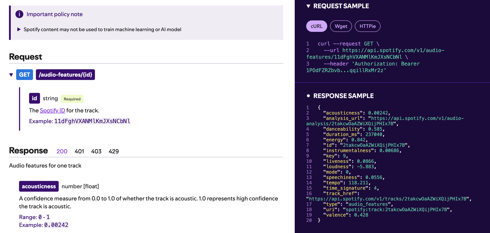
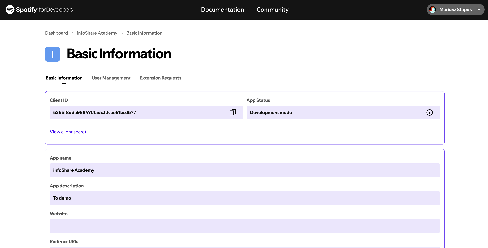

# Webinar data engineering

Tytuł: Alchemia danych: Jak Data Engineer tworzy wartość?
Data: 27.11.2024

## Opis 
Repozytorium zawiera dwa dema związane z data engineering: 
- integrację z API Spotify
- prosty przykład użycia Apache Airflow do automatyzacji procesów ETL.

## Struktura repozytorium
webinar_data_engineering/
├── README.md
├── code/
│   ├── [spotify.ipynb](code/spotify.ipynb)
│   ├── [airflow_dag.py](code/airflow_dag.py)
│   └── images/
│       │── 
│       └── audio_analysis.png
└── docs/
    └── [2024-11-27 - Data Engineer webinar.pdf](docs/2024-11-27%20-%20Data%20Engineer%20webinar.pdf)
